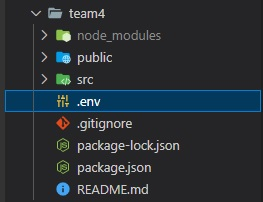

# React Frontend Project

## Tematica: Netflix
User: team4@test.com
Pass: 123456

* Single account supports up to five profiles.
* Profile user
* NavBar
* Search content
* Video description
* Video carousel
* Video player
> * Rate films after you've watched
> * Playlist
* Social sign in
* Multi-language support
> * Add search categories.
> * Match system (based on previous choices)
> * NO ADS
> * Sending feedback
* Account resitration(subscription method)

## Para instalar la aplicacion

### Deberas contar con los siguientes programas antes de instalar la aplicacion

<ol>
    <li>Git</li>
    <li>Visual Studio Code</li>
    <li>Node.js<l/i>
    <li>Archivo .env que deberas solicitar al administrador del proyecto</li>
</ol>

### Una vez instalados los programas deberas seguir estos pasos para probar la aplicacion

<ol>
    <li> Clonar el proyecto usando la consola de git (recomendado) o bien con la consola de powershel o VSC.
        
<code>git clone https://github.com/mvillalva/react-frontend-project.git</code>

    </li>
    <li>Ingresar a la carpeta team4 usando el comando cd e instalo todos los modulos usando el comando 'npm'
        
 <code> cd team4</code> 

        
 <code> npm install</code> 

    </li>
    <li>Copio el archivo .env provisto dentro de la carpeta team4 pero fuera de la carpeta src
        
    </li>
    <li>Finalmente ejecuto el comando para iniciar la aplicacion
        
 <code>npm start</code> 

    </li>
</ol>